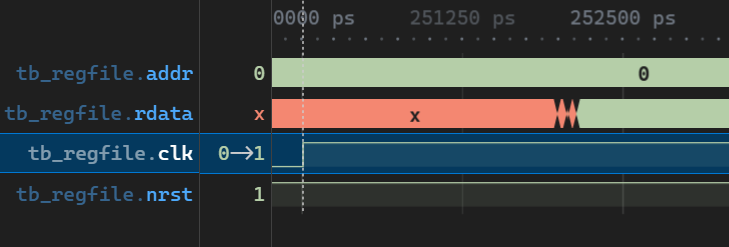

# Regfile: Sample for Core Hardening

Flow that generates regfiles all the way to initial floorplan for area estimates

## Sample usage

```bash
make sim # Perform simulations with Verilator
make iverilog # Perform simulations with IVerilog
make librelane # Harden the macro 
make sim_sdf # Perform simulations with SDF annotation
```

## Verilator Simulations

Verilator can simulate RTL as close as possible to gate-level functionality and is known to be the fastest simulator for large designs.

```bash
verilator $(VERILATOR_ARGS) tb/tb_regfile.sv $(RTL_SOURCES)
```

It has native support for systemverilog.
You must always use `--binary --exe` together in the arguments.

However, downsides are
- Ultra picky about linting errors
- Cannot do SDF (standard delay format) backannotation

## IVerilog Simulations

Icarus Verilog simulations work like so:

```bash
iverilog -g2012 -o sim/tb_regfile_iverilog tb/tb_regfile.sv $(RTL_SOURCES)
	sim/tb_regfile_iverilog 
```

- Can do SDF backannotation (albeit apparently with limited support)
- `-g2012` flag allows systemverilog simulation, but the support isn't complete either.

## Waveforms

This statement in `tb/tb_regfile.sv` tells the simulator (whichever one) to dump the waveforms.

```verilog
// Waveform Dump
initial begin
    $dumpfile("dump.vcd");
    $dumpvars(0, tb_regfile);
end
```
To view,
```
gtkwave dump.vcd
```

OR, if you're using the devcontainer in VSCode, just click the `dump.vcd` file and it should open in [VaporView](https://github.com/Lramseyer/vaporview)

## Delay annotation and Gate-level Simulations

A few files are necessary for gate-level simulation.
We can only perform this after hardening (or synthesis).

- `outputs/nl/regfile.nl.v` - The gate-level netlist of the module
- `outputs/sdf/...` - The delay file of the module

Once we have those, we can just run

```bash
iverilog -g2012 -o sim/tb_regfile_sdf tb/tb_regfile.sv \ # Our usual command
/foss/pdks/sky130A/libs.ref/sky130_fd_sc_hd/verilog/primitives.v \ # Skywater verilog libraries
src/sky130_fd_sc_hd.v \ # A corrected sky130_fd_sc_hd.v
outputs/nl/regfile.nl.v \
-DSDF_ANNOTATE \ # Directive. See testbench.
-DGATE_LEVEL \ # Directive. See testbench.
-gspecify \
-ginterconnect
```

> An important part of this is the corrected `sky130_fd_sc_hd.v`. This is just a copy of the one in `$PDKPATH/libs.ref/sky130_fd_sc_hd/verilog/sky130_fd_sc_hd.v` but with three lines commented out so they don't cause an error.

We can confirm that the SDF annotation works by viewing the waveform and finding that the reactions to `posedge clk` are delayed.

